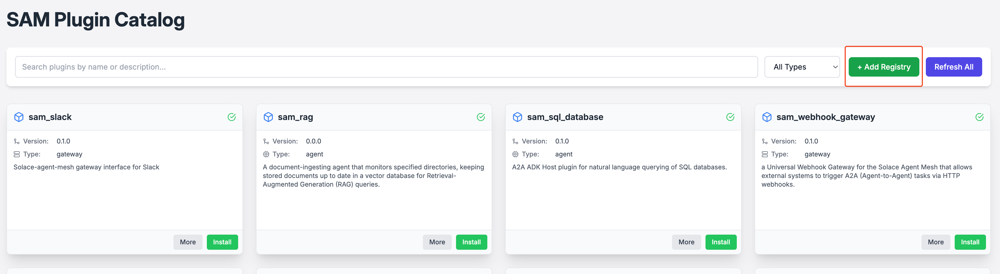
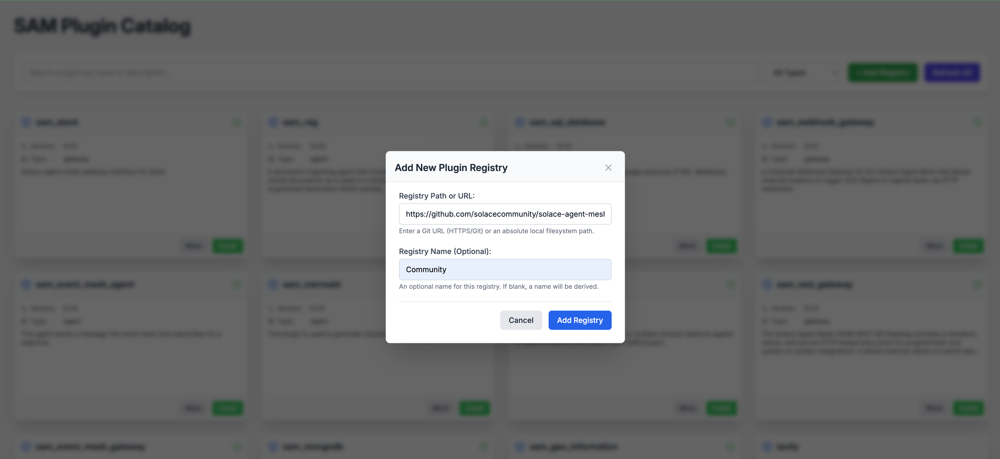
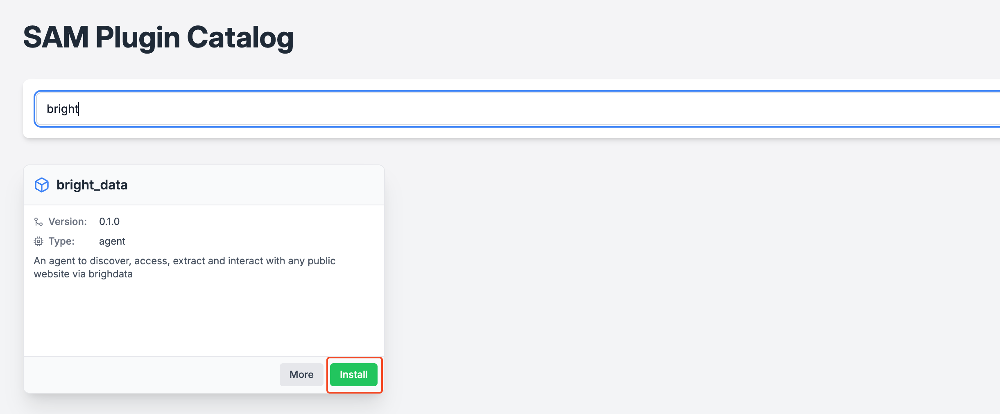
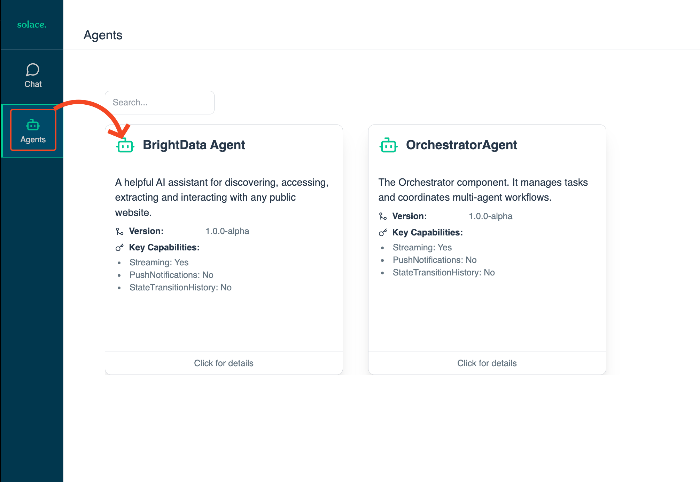

# Bright Data Plugin for Solace Agent Mesh

## Overview

The Bright Data plugin enables Solace Agent Mesh (SAM) to discover, access, extract, and interact with any public website using Bright Data's powerful web data platform. This plugin acts as a bridge between SAM and Bright Data's comprehensive web scraping and data extraction services.

## What is Bright Data?

[Bright Data](https://brightdata.com/) is a leading web data platform that provides:
- Large-scale web scraping capabilities
- Proxy networks for reliable data collection
- Structured data extraction from websites
- Real-time web data access
- Advanced anti-blocking technologies

## Plugin Details

- **Plugin Name**: `bright-data`
- **Version**: 0.1.0
- **Author**: Jamieson Walker <jamieson.walker@solace.com>
- **Repository**: [Solace Community Plugins](https://github.com/solacecommunity/solace-agent-mesh-plugins)

## Capabilities

This plugin provides SAM with the following capabilities:

### 🌐 Web Data Extraction
- Extract structured data from any public website
- Handle complex web pages with dynamic content
- Process large volumes of web data efficiently

### 🔍 Website Discovery
- Discover and analyze website content
- Navigate through website structures
- Identify data patterns and extraction opportunities

### 🤖 Automated Web Interaction
- Interact with web forms and interfaces
- Handle JavaScript-heavy websites
- Manage cookies and session states

### 📊 Structured Data Processing
- Convert unstructured web content to structured formats
- Apply data transformation rules
- Export data in various formats (JSON, CSV, etc.)

## How It Works

The Bright Data plugin integrates with SAM using the **MCP (Model Context Protocol)** wrapper pattern. This means:

1. **Plugin Configuration**: The plugin is defined in a `config.yaml` file that serves both as metadata and SAM agent configuration
2. **MCP Integration**: The plugin communicates with Bright Data's API through a standardized interface
3. **Natural Language Interface**: Users can interact with Bright Data's capabilities using natural language queries through SAM
4. **Tool Abstraction**: Complex web scraping operations are abstracted into simple, conversational commands

## Prerequisites

Before using this plugin, you need:

1. **Solace Agent Mesh v1**: Ensure you have SAM installed and configured
2. **Bright Data Account**: Sign up for a [Bright Data account](https://brightdata.com/)
3. **API Credentials**: Obtain your Bright Data API key from your account dashboard
4. **Python Environment**: Ensure you have a proper Python environment set up

## Installation and Setup

### Step 1: Add the Community Plugin Repository

1. Run `sam plugin catalog` from your python virtual environment and inside your SAM directory.
2. Add the Solace Community Plugin repository:
   
   ```bash 
   https://github.com/solacecommunity/solace-agent-mesh-plugins
   ```
   
   

### Step 2: Install the Plugin in SAM

Use SAM's plugin installation mechanism to install the Bright Data plugin with the gui or the CLI:

*GUI* 



*CLI*
```bash
sam plugin add bright-data --plugin bright-data
```
### Step 3: Configure Environment Variables

Set up your Bright Data API credentials as environment variables:

```bash
export BRIGHTDATA_TOKEN="your_api_key_here"
```


### Step 4: Verify Installation

Check that the plugin is properly installed and recognized by SAM:

```bash
sam run
```

Select agent page. You should see `bright-data` agent in the list of available agents.


## Usage Examples

Once installed, you can interact with the Bright Data plugin through natural language queries in SAM:

### Basic Web Scraping
```
"Extract product information from https://example-ecommerce.com/products"
```

### Structured Data Extraction
```
"Get all contact information from the company directory on https://example-corp.com/team"
```

### Competitive Analysis
```
"Collect pricing data from competitor websites for product comparison"
```

### Content Monitoring
```
"Monitor news articles about AI technology from major tech publications"
```

## Configuration File Structure

The plugin uses a `config.yaml` file that contains:

```yaml
plugin:
  name: bright-data
  version: 0.1.0
  description: "Web data extraction and website interaction using Bright Data"
  author: "Jamieson Walker <jamieson.walker@solace.com>"

sam_agent:
  # Complete SAM agent configuration
  # Tool definitions for Bright Data API integration
  # System prompts and behavior configuration
```

## Best Practices

### 🔒 Security
- Store API credentials in environment variables, never in code
- Use Bright Data's proxy rotation to avoid rate limiting
- Respect website robots.txt and terms of service

### ⚡ Performance
- Use Bright Data's session management for related requests
- Implement proper error handling and retry logic
- Consider data volume limits and processing timeouts

### 📋 Data Quality
- Validate extracted data structure and completeness
- Implement data cleaning and normalization processes
- Monitor extraction success rates and accuracy

## Troubleshooting

### Common Issues

**Plugin not found**: Ensure the plugin is properly installed in your SAM plugin directory.

**Authentication errors**: Verify your Bright Data API key is correctly set in environment variables.

**Rate limiting**: Check your Bright Data account limits and consider upgrading your plan if needed.

**Extraction failures**: Some websites may have anti-scraping measures; consult Bright Data documentation for advanced techniques.

### Getting Help

- Review the plugin's README.md file for detailed setup instructions
- Check the [Bright Data documentation](https://docs.brightdata.com/) for API-specific guidance
- Visit the [Solace Community](https://solace.community/) for plugin support and discussions

## Next Steps

After setting up the Bright Data plugin:

1. **Explore Capabilities**: Experiment with different types of websites and data extraction tasks
2. **Integrate with Other Agents**: Combine Bright Data extraction with other SAM agents for comprehensive workflows
3. **Monitor Usage**: Keep track of your Bright Data usage and costs
4. **Scale Up**: Consider upgrading your Bright Data plan for production workloads

## Related Resources

- [Solace Agent Mesh Documentation](https://solacelabs.github.io/solace-agent-mesh/)
- [MCP Integration Guide](https://solacelabs.github.io/solace-agent-mesh/docs/documentation/tutorials/mcp-integration/)
- [Bright Data Platform](https://brightdata.com/)
- [Community Plugin Repository](https://github.com/solacecommunity/solace-agent-mesh-plugins)
